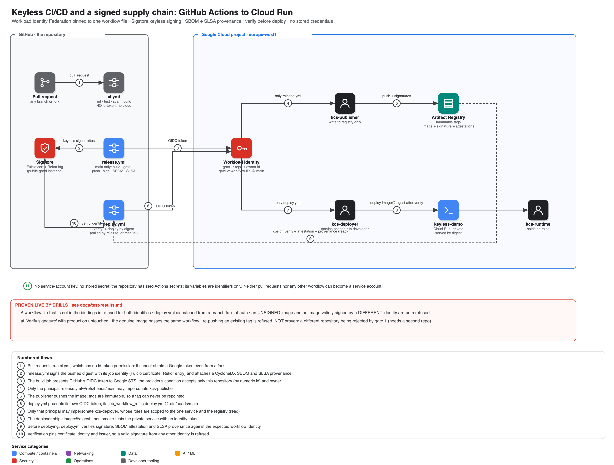

# Keyless CI/CD and a signed supply chain on Google Cloud

GitHub Actions reaches Cloud Run with **zero stored credentials**: Workload Identity Federation pinned to one workflow file on `main`, keyless Sigstore signing, an SBOM and SLSA provenance attached to every image, and a deploy workflow that **verifies before it ships**. Four live drills prove the boundary holds, not just that the happy path works.

> **Status: deployed and verified live** (project `claude-code-507112`, europe-west1, repo `soodrajesh/gcp-keyless-cicd-supply-chain`, 2026-09-28). `./scripts/test.sh`: **42 passed, 0 failed** — see [docs/test-results.md](docs/test-results.md), which also lists the seven real defects the first live runs exposed.

```bash
gcloud config set project <your-project>   # billing linked; push this repo to GitHub first
./scripts/up.sh    # infra -> the REAL release pipeline runs on GitHub Actions -> live tests + drills
./scripts/down.sh  # delete everything, including the GitHub repository variables
```



## What it proves

| Claim | Mechanism | Proven by |
|---|---|---|
| No stored credential anywhere | OIDC token → STS → short-lived access token; the org also forbids creating a key | test §3: zero user-managed keys; creating one is refused |
| Only this repo's `main` can authenticate | Provider condition pins the numeric repo + owner id | test §1 |
| Only the named workflow FILE can become each identity | `job_workflow_ref` binding on each service account | test §2, §8 |
| A pull request (even from a fork) gets no cloud access | `ci.yml` has no `id-token` permission | test §4 |
| A workflow on a branch is refused | `deploy.yml` dispatched from a branch fails at the auth step | test §8, the branch drill |
| An unsigned image is refused | `cosign verify` before deploy | test §9, the rogue drill |
| A validly-signed-by-someone-else image is refused | Identity + issuer are pinned, not "any valid signature" | test §9: signed by a different identity via real Sigstore, still refused |
| What's running is what was built | Deploy by digest; tags immutable; served build's own `/` reports its commit and run URL | test §5, §7 |

## Design decisions

| ADR | Decision |
|---|---|
| [0001](docs/adr/0001-two-gates-pin-the-workflow-file.md) | Two gates, and the second one pins the workflow file on `main` |
| [0002](docs/adr/0002-sigstore-verify-in-the-deploy-workflow.md) | Keyless Sigstore signing, verified by the deploy workflow — and the gap this leaves stated |
| [0003](docs/adr/0003-digests-immutable-tags-unique-per-run.md) | Digests, immutable tags, unique-per-run tags |
| [0004](docs/adr/0004-pull-requests-get-no-credentials.md) | Pull requests authenticate as nothing |

## Repository layout

```
.github/workflows/  ci.yml (PR, no cloud) · release.yml (build/gate/sign/attest) · deploy.yml (verify/deploy) · wif-negative.yml (drill)
app/                the demo service (reports its own build identity)
terraform/          Workload Identity, 3 service accounts, registry, private Cloud Run service
scripts/            up · down · test · verify (offline signature/SBOM/provenance check) · rogue-drill · check-pins
```

## Cost & safety

Free-tier: Cloud Run scales to zero, Artifact Registry storage is small, Workload Identity and Sigstore cost nothing. `down.sh` also removes the GitHub repository variables so a stale credential path can't linger.

## Known gaps (deliberate)

* **Enforcement lives in the pipeline, not the platform.** A human or service with `roles/run.developer` on the service could still deploy an unsigned image directly — see [ADR 0002](docs/adr/0002-sigstore-verify-in-the-deploy-workflow.md). Closing this needs Binary Authorization with an attestor that trusts this Sigstore identity.
* **A compromised `main` can change `release.yml` itself.** Branch protection is a repository setting this repo cannot prove from the outside.
* **Gate 1 (repo id) is asserted by reading the provider's condition, not attacked with a second repository** (this token lacks the permission to create/delete one safely).
* **Sigstore's public-good instance** is used; the repository and signing metadata are public. Do not reuse this exact setup for a private repository without a private Sigstore deployment.
